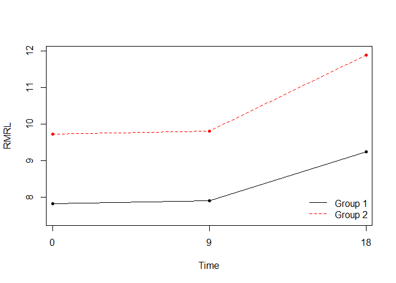
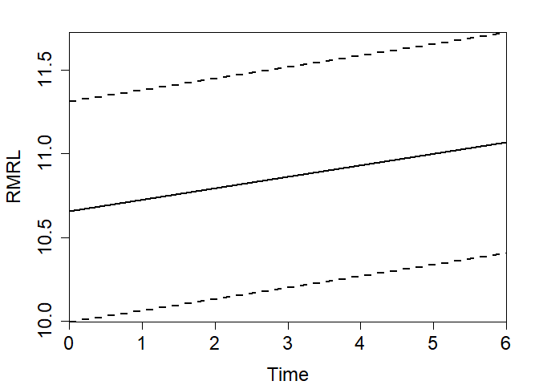

Get started with *pairsurv*
================

## About

Collection of two-sample tests for treatment effects with paired
censored survival data and recurrent events survival data. The methods
are implementations of three papers by Susan Murray and Nabihah Tayob.

## Install

First, install and load the `pairsurv` package from Github using the
following code:

If you have not installed devtools, run the following:

``` r
install.packages("devtools")
```

If devtools is sucessfully installed, run:

``` r
if(!require(pairsurv)) {
  library(devtools)
  install_github('umich-biostatistics/pairsurv') 
}
```

Load the package:

``` r
library(pairsurv)
```

## Summary of methods

This package implements methods from the following three papers by Tayob
and Murray:

### Method 1: Murray, 2000

##### Description

Perform two-sample tests for treatment effects with paired censored
survival data.

##### Reference

Murray, Susan. Nonparametric Rank-Based Methods for Group Sequential
Monitoring of Paired Censored Survival Data. 2000. Biometrics, 56,
pp. 984-990.

Jump to the `pairtest()` section for the methods from this paper.

### Method 2: Tayob and Murray, 2014

##### Description

Perform the Tayob and Murray two-sample recurrent events test.

##### Reference

Tayob, N. and Murray, S., 2014. Nonparametric tests of treatment effect
based on combined endpoints for mortality and recurrent events.
Biostatistics, 16(1), pp.73-83.

Jump to the `TM()` section for the methods from this paper.

### Method 3: Tayob and Murray, 2016

##### Description

Estimate the tau-restricted mean survival across multiple follow-up
intervals.

##### Reference

Tayob, N. and Murray, S., 2016. Nonparametric restricted mean analysis
across multiple follow-up intervals. Statistics & probability letters,
109, pp.152-158.

Jump to the `TM2()` section for the methods from this paper.

## Results

### pairtest()

#### Example 1: Analysis of package data set `pairdata`.

Enrolled 3711 patients with mild-to-severe nonproliferative or early
proliferative diabetic retinopathy in both eyes from April 1980 to July
1985.

  - One eye per patient was randomized to early photocoagulation
  - The other eye deferred photocoagulation until detection of high-risk
    proliferative retinopathy
  - Survival endpoint: Time to severe visual loss (defined as visual
    acuity \< 5/200 at two consecutive visits) subject to censoring
  - Eventually detected a benefit with early photocoagulation
  - After 9 years of follow-up, only 5.5% of patients had experienced
    the event (lots of censoring)

Important Feature of ETDRS Data Set (pairdata): Paired Event Times

Paired Design Attractive:

  - Historically used to minimize variability in treatment comparisons
  - With positive correlation in pairs that is taken into account in an
    analysis:
      - higher power for fixed sample size than independent designs
      - smaller required sample size for fixed power than independent
        designs
      - At the time the ETDRS study was published, the investigators did
        not have access to these paired tests for censored survival
        data, but they recognized the statistical issues relating to the
        correlated structure of the data. Some exploratory analysis on
        their part suggested “that not taking pairing into account led
        to conservative tests (ETDRS Research Group, 1991a, p. 749).”

Here is a preview of the data structure:

``` r
head(pairdata)
```

    ##   trt1      x1 delta1 trt2      x2 delta2
    ## 1    1 2922.00      0    2 2922.00      0
    ## 2    1 3043.75      0    2 3043.75      0
    ## 3    1 3043.75      0    2 3043.75      0
    ## 4    1 3043.75      0    2 3043.75      0
    ## 5    1  608.75      0    2  608.75      0
    ## 6    1 3165.50      0    2 3165.50      0

Documentation for pairsurv:

``` r
?pairsurv
```

The function `pairsurv` requires the time-to-event data for each pair
(`x1` and `x2`) and the event indicator for each of the times (`delta1`
for `x1`, and `delta2` for `x2`). The event indicators (`delta1`,
`delta2`) equal 1 if the event occurred and 0 if the patient was
censored.

The call to `pairtest` produces the results for Murray’s paired test:

``` r
eyeresults = pairtest(x1 = pairdata$x1, delta1 = pairdata$delta1, 
                      x2 = pairdata$x2, delta2 = pairdata$delta2, n = 3711)
```

Print a summary of the results:

``` r
summary(eyeresults)
```

    ## 
    ##  ************  Paired sample test results  ************
    ## 
    ##  Reference Paper: Murray, Susan. Nonparametric Rank-Based Methods for Group
    ##  Sequential Monitoring of Paired Censored Survival Data. 2000. Biometrics,
    ##  56, pp. 984-990.
    ## 
    ##  Upper limit of integration is 3287.25
    ## 
    ##   Logrank statistic: 
    ##    Logrank estimate = -4.8791, p-value = <0.0001
    ## 
    ##   Gehan statistic: 
    ##    Gehan estimate = -4.4552, p-value = <0.0001
    ## 
    ##   Pepe and Fleming statistic: 
    ##    PF estimate = 3.7537, p-value = 2e-04
    ## 
    ##   Years of Life Statistic: 
    ##    YLS estimate = 4.6432, p-value = <0.0001
    ## 
    ##    YLS area between curves = 50.4423
    ##      95% CI for YLS area between curves = (29.2249, 71.6597)
    ## 
    ## 
    ## 
    ##  *****  Results assuming independence (included for comparison)  *****
    ## 
    ##   Logrank statistic: 
    ##    Logrank estimate = -3.9792, p-value = 1e-04
    ## 
    ##   Gehan statistic: 
    ##    Gehan estimate = -3.5784, p-value = 3e-04
    ## 
    ##   Pepe and Fleming statistic: 
    ##    PF estimate = 2.9891, p-value = 0.0028
    ## 
    ##   Years of Life Statistic: 
    ##    YLS estimate = 3.7903, p-value = 2e-04
    ## 
    ##    YLS area between curves = 50.4423
    ##     95% CI for YLS area between curves = (24.3762, 76.5084)

If you need to access any result not printed by pairtest, use the $
operator to search available objects to extract. The test statistic and
p-value for each test is returned from the call to pairsurv in a list.

Here are the printed and stored results extracted from pairsurv:

``` r
# Upper limit of integration
(integration_upper_limit = eyeresults$upperlim)
```

    ## [1] 3287.25

``` r
# Logrank statistic
(logrank_statistic = eyeresults$lgrk.stat.p)
```

    ## [1] -4.879149

``` r
(logrank_statistic_p = 2*(pnorm(logrank_statistic, lower.tail = T))) # since negative statistic
```

    ## [1] 1.065445e-06

``` r
# Gehan statistic
(gehan_statistic = eyeresults$gehan.stat.p)
```

    ## [1] -4.455191

``` r
(gehan_statistic_p = 2*(pnorm(gehan_statistic, lower.tail = T))) # since negative statistic
```

    ## [1] 8.381839e-06

``` r
# Years of Life statistic
(yls_statistic = eyeresults$yls.stat.p)
```

    ## [1] 4.643191

``` r
(yls_statistic_p = 2*(pnorm(yls_statistic, lower.tail = F))) # since positive statistic
```

    ## [1] 3.430687e-06

``` r
# Pepe Fleming statistic
(pepe_flem_statistic = eyeresults$pf.stat.p)
```

    ## [1] 3.753704

``` r
(pepe_flem_statistic_p = 2*(pnorm(pepe_flem_statistic, lower.tail = F))) # since positive statistic
```

    ## [1] 0.0001742406

``` r
# Logrank statistic assuming independence
(logrank_assuming_indep = eyeresults$lgrk.nopair.stat.p)
```

    ## [1] -3.979193

``` r
(logrank_assuming_indep_p = 2*(pnorm(logrank_assuming_indep, lower.tail = T)) ) # since negative statistic
```

    ## [1] 6.914966e-05

``` r
# Gehan statistic assuming independence
(gehan_assuming_indep = eyeresults$gehan.nopair.stat.p)
```

    ## [1] -3.578396

``` r
(gehan_assuming_indep_p = 2*(pnorm(gehan_assuming_indep, lower.tail = T))) # since negative statistic
```

    ## [1] 0.0003457093

``` r
# Years of Life assuming independence
(yls_assuming_indep = eyeresults$yls.nopair.stat.p)
```

    ## [1] 3.790307

``` r
(yls_assuming_indep_p = 2*(pnorm(yls_assuming_indep, lower.tail = F))) # since positive statistic
```

    ## [1] 0.0001504609

``` r
# Pepe Fleming assuming independence
(pf_assuming_indep = eyeresults$pf.nopair.stat.p)
```

    ## [1] 2.989121

``` r
(pf_assuming_indep_p = 2*(pnorm(pf_assuming_indep, lower.tail = F))) # since positive statistic
```

    ## [1] 0.002797816

``` r
# group size adjustment
nstuff = ((3711*3711) / (3711 + 3711))^(.5)

# estimate area between survival curves and 95% conf. int.
(yls.diff = eyeresults$yls.num / nstuff)
```

    ## [1] 50.44231

``` r
(yls.upper = yls.diff + 1.96*sqrt(eyeresults$yls.type.var) / nstuff)
```

    ## [1] 71.65974

``` r
(yls.lower = yls.diff - 1.96*sqrt(eyeresults$yls.type.var) / nstuff)
```

    ## [1] 29.22487

``` r
# 95% CI assuming independence
(yls.upper2 = yls.diff + 1.96*sqrt(eyeresults$yls.nopair.type.var) / nstuff)
```

    ## [1] 76.50841

``` r
(yls.lower2 = yls.diff - 1.96*sqrt(eyeresults$yls.nopair.type.var) / nstuff)
```

    ## [1] 24.37621

##### Other options in summary and plot methods

The result of `summary()` of a pairtest object has a digits option to
specify more or less precision than the default:

``` r
summary(eyeresults, digits = 6)
```

    ## 
    ##  ************  Paired sample test results  ************
    ## 
    ##  Reference Paper: Murray, Susan. Nonparametric Rank-Based Methods for Group
    ##  Sequential Monitoring of Paired Censored Survival Data. 2000. Biometrics,
    ##  56, pp. 984-990.
    ## 
    ##  Upper limit of integration is 3287.25
    ## 
    ##   Logrank statistic: 
    ##    Logrank estimate = -4.879149, p-value = <0.0001
    ## 
    ##   Gehan statistic: 
    ##    Gehan estimate = -4.455191, p-value = <0.0001
    ## 
    ##   Pepe and Fleming statistic: 
    ##    PF estimate = 3.753704, p-value = 0.000174
    ## 
    ##   Years of Life Statistic: 
    ##    YLS estimate = 4.643191, p-value = <0.0001
    ## 
    ##    YLS area between curves = 50.442307
    ##      95% CI for YLS area between curves = (29.224871, 71.659744)
    ## 
    ## 
    ## 
    ##  *****  Results assuming independence (included for comparison)  *****
    ## 
    ##   Logrank statistic: 
    ##    Logrank estimate = -3.979193, p-value = <0.0001
    ## 
    ##   Gehan statistic: 
    ##    Gehan estimate = -3.578396, p-value = 0.000346
    ## 
    ##   Pepe and Fleming statistic: 
    ##    PF estimate = 2.989121, p-value = 0.002798
    ## 
    ##   Years of Life Statistic: 
    ##    YLS estimate = 3.790307, p-value = 0.00015
    ## 
    ##    YLS area between curves = 50.442307
    ##     95% CI for YLS area between curves = (24.376206, 76.508408)

### TM()

Repeated time-to-event data with two treatment groups.

The example data set contains 200 observations of 10 variables, where
each row contains a subject ID, one covariate, censoring indicator,
group indicator, and Z (a set of times to each follow up).

``` r
data("TMdata")
```

Preview the data set:

``` r
head(TMdata)
```

    ##   Subject_ID         X delta Group         Z1        Z2       Z3       Z4
    ## 1          1  0.598856     1     0         NA        NA       NA       NA
    ## 2          2 36.000000     0     0 11.7843615 20.691954 32.05130 33.29467
    ## 3          3 36.000000     0     0  0.5648492  1.872298       NA       NA
    ## 4          4 13.787539     1     0  6.0563473  7.030976       NA       NA
    ## 5          5 36.000000     0     0 19.4491843 23.918833       NA       NA
    ## 6          6 35.641625     0     0  4.1583020 14.520710 28.53374 28.88872
    ##        Z5 Z6
    ## 1      NA NA
    ## 2      NA NA
    ## 3      NA NA
    ## 4      NA NA
    ## 5      NA NA
    ## 6 32.7957 NA

Documentation for TM:

``` r
?TM
```

This method requires some pre-processing of the data. Follow our
example:

``` r
N = nrow(TMdata) # Number of subjects
X = TMdata$X
delta = TMdata$delta
table(delta)
```

    ## delta
    ##   0   1 
    ## 108  92

``` r
Z = TMdata[,c('Z1', 'Z2', 'Z3', 'Z4', 'Z5', 'Z6')]
A = max(X) # length of the study
Treatment = as.numeric(TMdata$Group == 1) #1 if Case and 0 if Control
table(Treatment, delta)
```

    ##          delta
    ## Treatment  0  1
    ##         0 47 53
    ##         1 61 39

The call to `TM` produces the results for the Tayob and Murray
two-sample recurrent events test.

The two available methods for assessing treatment differences include
“average” for mean difference test or “area” for area between the RMRL
curves. The `method = "average"` default is assumed if not explicitly
specified.

``` r
srec.average = TM(X = X, delta = delta, Z = Z, Group = Treatment, Tau = A/2, 
                  t = seq(from = 0, to = A-A/2, by = A/4))
```

Print a summary of the results:

``` r
summary(srec.average)
```

    ## 
    ##  ************ Two-Sample Test for combined end-point across multiple follow-up windows ************ 
    ## 
    ##  Reference Paper: Nonparametric Tests of Treatment Effect for a Recurrent
    ##  Event process that Terminates - N Tayob and S Murray
    ## 
    ##  Group definitions:
    ##   Group 1: Group = 0
    ##   Group 2: Group = 1
    ## 
    ##  Sample Size: 
    ##   Group 1: 100
    ##   Group 2: 100
    ## 
    ##  Follow-up windows:
    ##   [0,18]     [9,27]     [18,36]     
    ## 
    ##  Sample Estimates: Average restricted mean survival across follow-up windows
    ##   Group 1: 8.1845
    ##   Group 2: 10.2669
    ## 
    ##   Alternative hypothesis: True difference in the average restricted mean 
    ##         survival across follow-up windows is not equal to 0
    ##    Test-statistic = 3.1836, p-value = 0.0015

Now with `method = "area"`:

``` r
srec.area = TM(X = X, delta = delta, Z = Z, Group = Treatment, Tau = A/2, 
               t = seq(from = 0, to = A-A/2, by = A/4), method = "area")
```

``` r
summary(srec.area)
```

    ## 
    ##  ************ Two-Sample Test for combined end-point across multiple follow-up windows ************ 
    ## 
    ##  Reference Paper: Nonparametric Tests of Treatment Effect for a Recurrent
    ##  Event process that Terminates - N Tayob and S Murray
    ## 
    ##  Group definitions:
    ##   Group 1: Group = 0
    ##   Group 2: Group = 1
    ## 
    ##  Sample Size: 
    ##   Group 1: 100
    ##   Group 2: 100
    ## 
    ##  Follow-up windows:
    ##   [0,18]     [9,27]     [18,36]     
    ## 
    ##  Sample Estimates: Area under RMRL function evaluated for each follow-up window
    ##   Group 1: 147.8743
    ##   Group 2: 185.3959
    ## 
    ##  Alternative hypothesis: True difference in the area under the RMRL functions 
    ##         is not equal to 0
    ##    Test-statistic = 3.0502, p-value = 0.0023

If the area method is used, a plot option is also available:

``` r
plot(srec.area)
```

<!-- -->

##### Other options in summary and plot methods

The result of `summary()` of a TM object has a digits option to specify
more or less precision than the default:

``` r
summary(srec.area, digits = 6)
```

    ## 
    ##  ************ Two-Sample Test for combined end-point across multiple follow-up windows ************ 
    ## 
    ##  Reference Paper: Nonparametric Tests of Treatment Effect for a Recurrent
    ##  Event process that Terminates - N Tayob and S Murray
    ## 
    ##  Group definitions:
    ##   Group 1: Group = 0
    ##   Group 2: Group = 1
    ## 
    ##  Sample Size: 
    ##   Group 1: 100
    ##   Group 2: 100
    ## 
    ##  Follow-up windows:
    ##   [0,18]     [9,27]     [18,36]     
    ## 
    ##  Sample Estimates: Area under RMRL function evaluated for each follow-up window
    ##   Group 1: 147.874302
    ##   Group 2: 185.395896
    ## 
    ##  Alternative hypothesis: True difference in the area under the RMRL functions 
    ##         is not equal to 0
    ##    Test-statistic = 3.050175, p-value = 0.002287

### TM2()

The function `TM2()` allows the user to compute restricted mean survival
across multiple follow-up intervals.

The reference paper is Tayob, N. and Murray, S., 2016. Nonparametric
restricted mean analysis across multiple follow-up intervals. Statistics
& probability letters, 109, pp.152-158.

This method allows for flexibility in choosing variance estimate for the
restricted mean survival. The options are `proposed`, `sandwich`, and
`independence`. See the reference paper for details.

The data set contains follow-up times over multiple intervals (X) and
the censoring indicator (delta; 1 if subject died, 0 if censored). The
data set is in the “long” format where multiple events are each recorded
as a new row rather than a new column.

The data set contains a total of 100 follow-up times.

``` r
data("TM2data")
#?TM2data
```

The maximum recorded time in the data set is:

``` r
max(TM2data$X)
```

    ## [1] 36

Similar to the other methods in this package, `TM2` is the work-horse
estimation function and calling `summary()` on the resultant fit object
produces a printed summary of the output, and calling `plot()` produces
a plot of the estimate and 95% bounds.

Documentation for TM2:

``` r
?TM2
```

An example of analysis with `tau = 12` and all three variance estimates:

``` r
output = TM2(X = TM2data$X, delta = TM2data$delta, Tau = 12, 
             t = seq(from = 0, to = 24, by = 6), var_output = "all")
summary(output)
```

    ## 
    ##  ****************************************************************************************
    ##  Nonparametric estimation of restricted mean survival across multiple follow-up intervals
    ##  ****************************************************************************************
    ## 
    ##  Reference Paper: Tayob, N. and Murray, S., 2016. Nonparametric restricted mean analysis
    ##  across multiple follow-up intervals. Statistics & probability letters, 109, pp.152-158.
    ## 
    ##   Number of patients used in the analysis is 100
    ## 
    ##   Start time of follow-up intervals: 0 6 12 18 24
    ## 
    ##   Restricted Mean Survival Estimate = 10.9551
    ## 
    ##    Proposed Variance = 0.0277
    ## 
    ##    Sandwich Variance = 0.022
    ## 
    ##    Independent Variance = 0.0186

``` r
plot(output)
```

<!-- -->

An example of analysis with `tau = 12` and proposed variance estimate
only (default):

``` r
output = TM2(X = TM2data$X, delta = TM2data$delta, Tau = 12, 
             t = seq(from = 0, to = 24, by = 6))
summary(output)
```

    ## 
    ##  ****************************************************************************************
    ##  Nonparametric estimation of restricted mean survival across multiple follow-up intervals
    ##  ****************************************************************************************
    ## 
    ##  Reference Paper: Tayob, N. and Murray, S., 2016. Nonparametric restricted mean analysis
    ##  across multiple follow-up intervals. Statistics & probability letters, 109, pp.152-158.
    ## 
    ##   Number of patients used in the analysis is 100
    ## 
    ##   Start time of follow-up intervals: 0 6 12 18 24
    ## 
    ##   Restricted Mean Survival Estimate = 10.9551
    ## 
    ##    Proposed Variance = 0.0277

``` r
plot(output)
```

<!-- -->

An example of analysis with `tau = 12` and independent variance estimate
only:

``` r
output = TM2(X = TM2data$X, delta = TM2data$delta, Tau = 12, 
             t = seq(from = 0, to = 24, by = 6), var_output = "independence")
summary(output)
```

    ## 
    ##  ****************************************************************************************
    ##  Nonparametric estimation of restricted mean survival across multiple follow-up intervals
    ##  ****************************************************************************************
    ## 
    ##  Reference Paper: Tayob, N. and Murray, S., 2016. Nonparametric restricted mean analysis
    ##  across multiple follow-up intervals. Statistics & probability letters, 109, pp.152-158.
    ## 
    ##   Number of patients used in the analysis is 100
    ## 
    ##   Start time of follow-up intervals: 0 6 12 18 24
    ## 
    ##   Restricted Mean Survival Estimate = 10.9551
    ## 
    ##    Independent Variance = 0.0186

``` r
plot(output)
```

<!-- -->

An example of analysis with `tau = 12` and sandwich variance estimate
only:

``` r
output = TM2(X = TM2data$X, delta = TM2data$delta, Tau = 12, 
             t = seq(from = 0, to = 24, by = 6), var_output = "sandwich")

summary(output)
```

    ## 
    ##  ****************************************************************************************
    ##  Nonparametric estimation of restricted mean survival across multiple follow-up intervals
    ##  ****************************************************************************************
    ## 
    ##  Reference Paper: Tayob, N. and Murray, S., 2016. Nonparametric restricted mean analysis
    ##  across multiple follow-up intervals. Statistics & probability letters, 109, pp.152-158.
    ## 
    ##   Number of patients used in the analysis is 100
    ## 
    ##   Start time of follow-up intervals: 0 6 12 18 24
    ## 
    ##   Restricted Mean Survival Estimate = 10.9551
    ## 
    ##    Sandwich Variance = 0.022

``` r
plot(output)
```

<!-- -->

##### Other options in summary and plot methods

Use `?` to explore other options to summary and plot:

``` r
?summary.TM2
```

As you can see from the `Usage` section of the document, the `digits =`
argument can optionally be specified if you prefer more or less
precision.

``` r
?plot.TM2
```

Optional arguments for the plot method include `alpha = 0.05,
conservative_index = 25, k = 500, n.sim = 1000`.

Here is a summary from the documentation:

  - `alpha` is the significance level for the confidence bands
  - `conservative_index` is the minimum number of events after the start
    of the last interval
  - `k` is the number of points for integration within follow-up window
    \[0,Tau\]
  - `n.sim` is the number of samples simulated to calculate confidence
    bands

These arguments can be adjusted to suit the user’s plotting needs.
